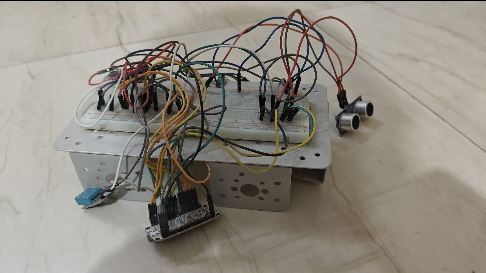

## Wiring Explanation (Step-by-Step)

EnviroGuard uses a **NodeMCU ESP8266**, which works at **3.3V logic**. All ground pins must be connected together to a common GND.

### Power Connections

* NodeMCU **3.3V** → DHT11 VCC, Flame Sensor VCC, OLED VCC
* NodeMCU **Vin (5V)** → MQ2 VCC, Ultrasonic VCC
* NodeMCU **GND** → GND of all sensors, OLED, and buzzer

Always connect GND first to avoid unstable readings.

### DHT11 (Temperature & Humidity)

* DATA → D3
* VCC → 3.3V
* GND → GND

D3 is used as a digital input pin to read temperature and humidity values.

### Flame Sensor

* AO (Analog Output) → A0
* VCC → 3.3V
* GND → GND

The flame sensor outputs an analog value based on infrared light intensity. Lower values indicate flame detection.

### MQ2 Gas Sensor

* AO (Analog Output) → A0
* VCC → Vin (5V)
* GND → GND

Important note
NodeMCU has **only one analog pin (A0)**. In this project, the flame sensor and MQ2 sensor share the A0 pin. Their values are read one after the other in software. Only one sensor should be actively interpreted at a time.

### Ultrasonic Sensor (HC-SR04)

* TRIG → D5
* ECHO → D6
* VCC → Vin (5V)
* GND → GND

The trigger pin sends an ultrasonic pulse, and the echo pin receives it back to calculate distance.

### Buzzer

* Positive (+) → D7
* Negative (–) → GND

The buzzer is activated when flame or harmful gas is detected.

### OLED Display (I2C)

* SDA → D2
* SCL → D1
* VCC → 3.3V
* GND → GND

OLED I2C address used: `0x3C`
D1 and D2 are standard I2C pins on NodeMCU.

---

## Wiring Tips

* Avoid powering MQ2 from 3.3V; it requires more current (it somehow worked for me, but not for others).
* Use short wires for A0 connections to reduce noise
* Let MQ2 warm up for accurate readings
* Double-check pin labels on NodeMCU (D-numbers ≠ GPIO numbers)
